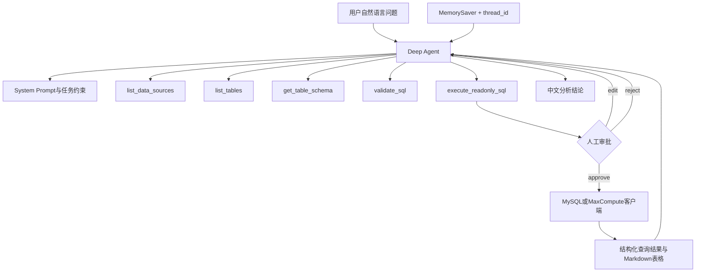

# 本地数据问答 Deep Agent 项目拆解与面试回答

> [!summary] 项目定位
> 基于 Deep Agents、LangChain 和 LangGraph 构建本地数据问答智能体，将自然语言问题转换为受控的数据源发现、元数据查询、只读 SQL 生成、人工审批和结果解读流程。

## 一、项目概述

### 项目名称

本地数据问答 Deep Agent（Local Data Q&A Deep Agent）

### 适用岗位

- AI 应用工程师
- Agent 开发工程师
- 数据工程师
- 数据平台开发工程师

### 项目背景

数据开发和分析人员在处理临时需求时，通常需要经历以下步骤：

1. 确认数据在哪个数据源。
2. 查找可能相关的表。
3. 阅读表结构和字段注释。
4. 编写 SQL。
5. 检查 SQL 是否安全。
6. 执行查询并解释结果。

这些步骤包含大量重复的信息检索和 SQL 草拟工作，但直接让大模型连接数据库又存在误操作、越权查询和大表扫描风险。

因此，该项目的目标不是让大模型任意执行 SQL，而是建立一条可控的数据问答链路：

```text
自然语言问题
→ 数据源与元数据发现
→ 生成只读SQL
→ 安全校验
→ 人工审批
→ 执行查询
→ 中文结果解读
```

## 二、当前实现效果

项目当前已经实现：

- 支持 MySQL 和 MaxCompute 两类数据源。
- 自动判断数据源是否完成配置。
- 支持按关键词查找数据表。
- 支持读取表字段、类型、主键、默认值和注释。
- 根据表结构生成只读 SQL。
- 拦截常见写入和 DDL 关键字。
- 限制单次返回数据量。
- SQL 执行前必须人工 `approve`、`edit` 或 `reject`。
- 查询结果转换为 Markdown 表格并由模型生成中文解读。
- 支持终端多轮对话。
- 支持 OpenAI 官方接口和 OpenAI-compatible 第三方接口。

已经实际验证过的场景：

> 查询 MySQL 中 `ods_feishu_bitable_records` 的表结构，智能体能够调用元数据工具并输出字段、类型、主键、索引和字段说明。

## 三、技术栈

| 类型 | 技术 | 作用 |
|---|---|---|
| Agent Harness | Deep Agents | 创建具备工具调用和中断能力的 Agent |
| Agent 基础组件 | LangChain | 模型封装、Tool 定义和消息处理 |
| 工作流运行时 | LangGraph | Checkpointer、thread_id、Interrupt 和恢复执行 |
| 模型接入 | ChatOpenAI | 接入 OpenAI 或兼容接口 |
| MySQL | PyMySQL | 元数据查询和只读 SQL 执行 |
| MaxCompute | PyODPS | 表列表、Schema 和 SQL 查询 |
| 配置管理 | python-dotenv | 从 `.env` 读取模型和数据源配置 |
| 交互方式 | Python CLI | 单次提问和终端多轮对话 |

## 四、系统架构



## 五、项目目录

```text
deepagents-quickstart/
├── app.py
├── requirements.txt
├── README.md
└── data_qa_agent/
    ├── __init__.py
    ├── config.py
    ├── connections.py
    ├── prompts.py
    ├── sql_safety.py
    └── tools.py
```

### 模块职责

| 文件 | 职责 |
|---|---|
| `app.py` | 创建模型和 Agent、处理多轮输入、人工审批和状态恢复 |
| `config.py` | 读取 MySQL、MaxCompute、行数限制等环境配置 |
| `connections.py` | 封装 MySQL 与 MaxCompute 的统一数据访问能力 |
| `tools.py` | 将数据源能力封装为 LangChain Tools |
| `sql_safety.py` | 只读 SQL 校验、危险关键字拦截和 LIMIT 检查 |
| `prompts.py` | 定义 Agent 的任务目标、工具使用顺序和安全规则 |

## 六、核心工具设计

### 1. `list_data_sources`

作用：检查 MySQL 和 MaxCompute 是否已经配置。

它只返回配置状态和需要的环境变量名称，不返回密码或 AccessKey。

### 2. `list_tables`

作用：列出指定数据源中的表，并支持关键词过滤和数量限制。

示例：

```text
在 MySQL 中查找名称包含 order 的表
```

### 3. `get_table_schema`

作用：在生成 SQL 前读取真实表结构。

MySQL 返回：

- 字段名
- 字段类型
- 是否为空
- 主键或索引信息
- 默认值
- 字段注释

MaxCompute 返回普通字段和分区字段。

### 4. `validate_sql`

作用：在执行前检查 SQL 是否符合只读和行数限制规则。

返回内容包括：

- 是否通过校验
- 规范化后的 SQL
- 错误列表
- 警告列表
- 行数限制

### 5. `execute_readonly_sql`

作用：执行已经通过校验的 SQL。

这是敏感工具，被配置为 Human-in-the-loop。Agent 不能直接执行，必须暂停并等待用户审批。

## 七、SQL 安全设计

### 当前安全措施

1. 只允许以 `SELECT` 或 `WITH` 开头的单条 SQL。
2. 移除普通 SQL 注释后再进行检查。
3. 拦截以下关键字：

```text
ALTER CREATE DELETE DROP GRANT INSERT MERGE
REPLACE REVOKE TRUNCATE UPDATE
```

4. 限制单次返回行数。
5. 未显式添加 `LIMIT` 时产生警告。
6. SQL 执行前必须人工审批。
7. 推荐数据库侧使用只读账号。

### 为什么需要多层保护

Prompt 中写“不要执行写入 SQL”只是一种软约束，模型仍可能出错。可靠的系统需要多层保护：

```text
System Prompt约束
→ Tool输入校验
→ SQL安全校验
→ 人工审批
→ 数据库只读账号
→ 查询日志与审计
```

### 当前不足

现阶段 SQL 校验主要依靠正则表达式和关键字检查，还不是完整 SQL 语法树校验。

生产化时应增加：

- 使用 SQLGlot 等解析器构建 AST。
- 只允许表白名单和字段白名单。
- 禁止危险函数和跨库访问。
- MySQL 使用真正的只读账号。
- MaxCompute 使用最小权限角色。
- 增加 `EXPLAIN`、扫描量和成本预估。
- 增加查询超时和并发限制。

## 八、Human-in-the-loop 实现原理

敏感工具配置：

```python
interrupt_on={
    "execute_readonly_sql": {
        "allowed_decisions": ["approve", "edit", "reject"]
    }
}
```

执行过程：

```text
Agent准备调用execute_readonly_sql
→ LangGraph触发Interrupt
→ CLI显示工具名和SQL参数
→ 用户选择approve、edit或reject
→ 使用Command(resume=...)恢复原工作流
```

三种操作：

| 操作 | 含义 |
|---|---|
| `approve` | 按 Agent 提议的 SQL 执行 |
| `edit` | 修改工具参数后再执行 |
| `reject` | 拒绝执行，并将原因返回给 Agent |

这个设计把模型的“建议权”和系统的“执行权”分开。

## 九、多轮对话原理

项目在交互模式中只创建一次 Agent，并为当前会话生成固定的 `thread_id`：

```text
程序启动
→ 创建Agent和MemorySaver
→ 创建thread_id
→ 用户连续输入问题
→ 每轮使用相同thread_id调用Agent
```

`MemorySaver` 保存当前进程内的消息、工具调用和工作流状态，因此用户可以继续追问：

```text
第一轮：查看 ods_feishu_bitable_records 的表结构
第二轮：哪个字段适合作为增量同步时间？
第三轮：根据这个字段生成最近一天的查询SQL
```

当前限制：程序关闭后，`MemorySaver` 中的会话状态会消失。

生产化时可以替换为 SQLite 或 PostgreSQL Checkpointer，让程序重启后仍能根据 `thread_id` 恢复会话。

## 十、多数据源抽象

项目通过统一客户端接口屏蔽 MySQL 和 MaxCompute 的差异：

```text
list_tables(pattern)
describe_table(table_name)
execute(sql, limit)
```

`get_client(source)` 根据用户或 Agent 提供的 `source` 返回不同实现：

```text
mysql      → MySQLClient
maxcompute → MaxComputeClient
```

这样 Tool 层不需要关心具体数据库驱动，后续也可以继续增加 PostgreSQL、ClickHouse 或其他数据源。

## 十一、第三方模型接口兼容

项目使用 `ChatOpenAI` 显式配置：

- API Key
- Base URL
- 模型名称
- User-Agent
- `temperature=0`

在实际调试中发现，第三方 OpenAI-compatible 网关可以正常响应原始 HTTP 请求，但会拦截 OpenAI Python SDK 默认的 `User-Agent`。

解决方法是在模型客户端中显式覆盖兼容请求头。这个问题说明：

> OpenAI-compatible 不一定等于完全兼容，除了请求格式，还需要验证请求头、Tool Calling、流式输出和错误格式。

## 十二、一次完整调用流程

以“查看 MySQL 中某张表的结构”为例：

```text
1. 用户输入自然语言问题。
2. Agent根据System Prompt判断需要读取元数据。
3. Agent调用get_table_schema(source="mysql", table_name="...")。
4. MySQLClient查询information_schema.columns。
5. Tool把结果序列化为JSON返回Agent。
6. Agent按照中文Markdown格式整理字段、主键和索引信息。
7. 程序保存消息状态并等待下一轮输入。
```

如果问题需要真实数据：

```text
读取Schema
→ 生成SQL
→ validate_sql
→ execute_readonly_sql
→ 人工审批
→ 执行查询
→ 返回结果解读
```

## 十三、项目亮点

### 1. 不让模型直接裸连数据库

数据库能力被封装成职责明确、输入受控的 Tool，模型只能通过工具完成操作。

### 2. 元数据优先

要求 Agent 在字段不明确时先查询 Schema，降低虚构表名和字段名的概率。

### 3. 多层 SQL 安全

结合 Prompt、代码校验、人工审批和只读账号，而不是只依赖提示词。

### 4. 敏感操作可中断和恢复

使用 LangGraph Interrupt 和 `Command(resume=...)`，工作流暂停后不会丢失上下文。

### 5. 数据源可扩展

通过 Client 抽象统一 MySQL 和 MaxCompute，为新增数据源保留扩展点。

### 6. 支持多轮追问

通过 `MemorySaver` 和固定 `thread_id` 保存进程内会话状态。

### 7. 处理真实兼容性问题

定位并解决第三方网关拦截 SDK 默认请求头的问题，体现了接口协议和网络调试能力。

## 十四、项目不足与下一步

| 当前不足 | 下一步方案 |
|---|---|
| SQL 校验以正则为主 | 使用 SQLGlot AST 做语法和对象级校验 |
| 会话只保存在内存 | 使用 SQLite/PostgreSQL Checkpointer |
| 没有自动化测试目录 | 增加 Tool、SQL 安全和端到端测试 |
| 没有系统评测集 | 建立表发现、SQL 生成和任务完成率评测集 |
| 缺少线上可观测性 | 接入 LangSmith Trace、延迟和 Token 成本监控 |
| 没有表结构缓存 | 增加带过期时间的 Schema 缓存 |
| 大表查询缺少成本控制 | 增加 EXPLAIN、扫描量预估和查询预算 |
| CLI 交互为主 | 封装 FastAPI 并增加 Web 或飞书入口 |
| 未使用专业子代理 | 后续拆分 Schema、SQL、审核和结果解读子代理 |

## 十五、简历项目描述

### 项目名称

本地数据问答 Deep Agent

### 简历描述版本

- 基于 Deep Agents、LangChain 和 LangGraph 构建本地数据问答智能体，支持通过自然语言完成 MySQL/MaxCompute 数据源发现、表结构查询、只读 SQL 生成和结果解读。
- 将数据库能力封装为 Schema 查询、SQL 校验和只读执行工具，结合危险关键字拦截、返回行数限制、数据库只读账号及 Human-in-the-loop 审批控制查询风险。
- 使用 LangGraph Checkpointer、`thread_id` 和 Interrupt/Resume 实现进程内多轮对话及敏感工具的暂停恢复，并完成第三方 OpenAI-compatible API 的兼容性排查与接入。

> [!warning] 简历数据原则
> 当前项目还没有正式统计准确率、效率提升比例或成本数据，不要在面试中虚构“准确率提升XX%”或“效率提升XX%”。完成评测后再补充量化结果。

## 十六、30秒项目介绍

> 我做了一个本地数据问答 Deep Agent，主要解决数据开发人员查表、看字段、写临时查询和解释结果的重复工作。用户可以直接用自然语言提问，Agent 会先连接 MySQL 或 MaxCompute 查询真实表结构，再生成只读 SQL并进行安全校验。如果需要执行查询，会通过 LangGraph 的 Human-in-the-loop 暂停，只有用户审批后才执行。项目还通过 Checkpointer 和 thread_id 支持多轮追问，并对第三方 OpenAI-compatible API 做了兼容处理。

## 十七、1分钟面试回答

> 这个项目是一个面向数据开发场景的本地数据问答智能体，使用 Deep Agents、LangChain 和 LangGraph 实现。
>
> 它解决的问题是：数据人员面对临时分析需求时，需要反复查数据源、找表、看字段、写 SQL 和解释结果。我把这些能力封装成了五个工具，分别用于检查数据源、列出表、读取 Schema、校验 SQL 和执行只读 SQL。
>
> 在安全方面，我没有让模型直接操作数据库，而是要求它先读取真实表结构，再生成 SQL。代码层只允许 SELECT 和 WITH，拦截写入及 DDL 关键字，并限制返回行数。真正执行 SQL 前会触发 LangGraph Interrupt，用户可以 approve、edit 或 reject，数据库侧也建议使用只读账号。
>
> 对话状态通过 MemorySaver 和固定 thread_id 保存在当前进程中，所以可以根据上一轮表结构继续追问。这个项目让我重点实践了 Tool Calling、Agent 工作流、Human-in-the-loop、多数据源抽象和第三方模型接口兼容。

## 十八、3分钟结构化面试回答

### 1. 背景

> 数据开发和分析工作中有很多临时需求，真正耗时的往往不是 SQL 本身，而是确认数据源、查找表、理解字段和反复核对口径。我希望通过 Agent 降低这些重复操作，同时又不能让模型不受控制地访问数据库。

### 2. 方案

> 我使用 Deep Agents 创建主 Agent，使用 LangChain 定义工具，使用 LangGraph 管理状态和人工审批。底层数据源支持 MySQL 和 MaxCompute，并通过统一 Client 接口屏蔽两者差异。

### 3. 工作流程

> 用户提问后，Agent 先判断数据源是否可用，再通过 list_tables 和 get_table_schema 获取真实元数据。字段确认后生成只读 SQL，并调用 validate_sql 做程序化校验。需要真实执行时，execute_readonly_sql 会触发人工审批，用户确认后才连接数据库执行。结果被转换为结构化 JSON 和 Markdown 表格，再由模型解释。

### 4. 安全设计

> 我采用多层安全控制。Prompt 规定只读行为；Tool 层校验输入；SQL 层限制单条 SELECT/WITH 并拦截危险关键字；工作流层加入 Human-in-the-loop；数据库层使用只读账号。这样即使模型判断错误，也不能直接产生高风险写入。

### 5. 多轮与状态

> Agent 在交互模式下只创建一次，并使用固定 thread_id。MemorySaver 会保存消息、工具结果和工作流状态，因此可以围绕上一轮查询继续追问。如果生产化，我会换成 PostgreSQL Checkpointer，实现跨进程恢复。

### 6. 难点

> 一个难点是第三方模型平台虽然宣称 OpenAI-compatible，但 OpenAI SDK 请求被网关拦截，而原始 HTTP 请求可以成功。我通过对比请求链路定位到默认 User-Agent 兼容问题，显式覆盖请求头后解决。这让我意识到兼容接口不仅要验证 URL 和模型名，还要测试工具调用、请求头和错误格式。

### 7. 后续优化

> 目前 SQL 安全校验主要依赖正则，后续会引入 SQLGlot 做 AST 校验，再增加表白名单、成本预估、查询超时、LangSmith Trace 和固定评测集。同时把 CLI 封装成 FastAPI，并增加 Schema 缓存和持久化会话。

## 十九、高频追问及回答

### 为什么使用 Deep Agents，而不是直接调用大模型？

> 直接调用大模型只能得到文本输出，无法可靠连接数据库和控制执行流程。Deep Agents 提供 Agent Harness，能够组织 Tool Calling、任务状态和中断机制；它底层使用 LangGraph，因此适合需要工具、状态和人工审批的长流程任务。

### 为什么不直接让模型生成 SQL 后执行？

> 模型可能虚构字段、生成大表全扫或者产生写入语句。我的流程要求先查询真实 Schema，再进行程序化 SQL 校验，并在执行前人工确认。模型负责理解和建议，后端代码负责权限和执行控制。

### 如何防止模型执行危险 SQL？

> 当前有五层控制：System Prompt、SQL 关键字校验、单语句及行数限制、Human-in-the-loop、数据库只读账号。生产环境还会增加 SQL AST、表白名单、超时和扫描成本限制。

### 多轮对话是模型自己记住的吗？

> 不是。模型接口本身是无状态的。LangGraph 使用 Checkpointer 按 thread_id 保存消息和工具结果，下一轮调用时重新加载上下文。当前 MemorySaver 只支持进程内保存，生产环境会使用持久化 Checkpointer。

### 如何同时支持 MySQL 和 MaxCompute？

> 我定义了统一的数据访问能力，包括 list_tables、describe_table 和 execute，再分别实现 MySQLClient 与 MaxComputeClient。Tool 层只依赖统一接口，因此新增其他数据源时不需要重写 Agent 工作流。

### Agent 如何知道应该调用哪个工具？

> 主要依赖 Tool 名称、Docstring、参数 Schema 和 System Prompt。Prompt 还规定了顺序：不清楚表时先 list_tables，不清楚字段时先 get_table_schema，生成 SQL 后先 validate_sql，需要真实结果时才 execute_readonly_sql。

### 为什么使用人工审批？

> 数据查询虽然是只读操作，但仍可能扫描大表、访问敏感数据或产生费用。人工审批让用户在真正执行前看到 SQL 和参数，并拥有修改或拒绝的权利。

### 项目目前最大的技术不足是什么？

> 最大不足是 SQL 安全校验仍以规则和正则为主，不能完整理解 SQL 语义。其次是会话状态没有持久化，也缺少系统化评测。生产化优先级会是 AST 校验、只读账号、评测集和持久化 Checkpointer。

### 如何评估这个 Agent？

> 我会建立固定测试集，分别评估表选择正确率、字段引用正确率、SQL 可执行率、危险 SQL 拦截率、工具选择正确率和最终任务完成率；线上再统计 P95 延迟、人工拒绝率、Token 成本和失败类型。

### 如何防止提示注入？

> 数据库返回值和外部文档都按不可信数据处理，不能覆盖 System Prompt。真正的安全边界必须在 Tool 和数据库权限层实现，而不是让模型自行判断。还要限制工具白名单、参数范围和数据访问权限。

## 二十、STAR回答模板

### Situation

> 数据开发临时取数需要频繁查表、看字段、写 SQL，同时直接让大模型操作数据库存在安全风险。

### Task

> 构建一个能够理解自然语言、连接多数据源、生成并受控执行只读 SQL 的本地数据问答智能体。

### Action

> 使用 Deep Agents 和 LangChain 封装数据源发现、表结构读取、SQL 校验和执行工具；使用 LangGraph Interrupt 实现 SQL 执行前审批；通过统一 Client 适配 MySQL 和 MaxCompute；使用 MemorySaver 和 thread_id 支持多轮追问；同时处理第三方模型网关兼容问题。

### Result

> 当前已经跑通 MySQL 表结构查询、多轮终端交互和人工审批链路，能够输出结构化字段信息和中文解释。项目尚未完成量化评测，下一步会补充 SQL AST 安全校验、固定评测集、LangSmith Trace 和持久化会话。

## 二十一、演示建议

面试演示可以依次输入：

```text
1. 列出当前可用数据源
2. 在MySQL中查找名称包含feishu的表
3. 查看ods_feishu_bitable_records的表结构
4. 哪个字段适合做增量同步时间？
5. 生成查询最近一天数据的SQL，但先不要执行
6. 执行该SQL
```

第 6 步会触发人工审批，可以展示 `approve`、`edit` 和 `reject` 的差异。

## 二十二、相关笔记

- [[LangChain学习笔记]]
- [[01-学习路线与核心内容]]
- [[03-Deep Agents人员数据质量项目实操]]
- [[AI解决方案工程师能力图谱与学习路线]]
- [[飞书API到MySQL数仓落库方案]]

