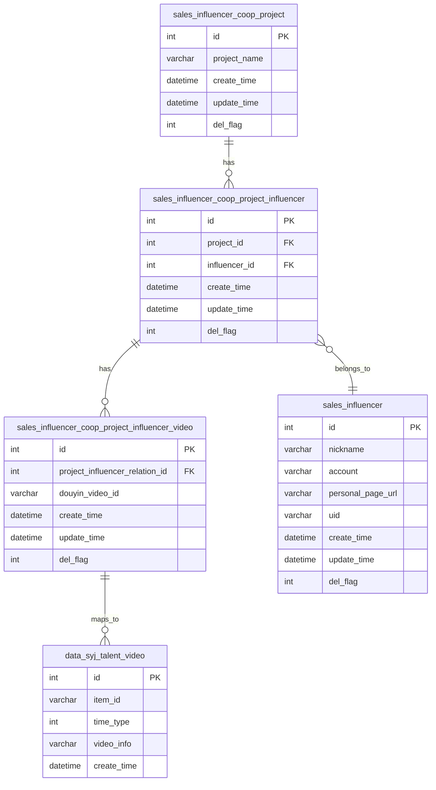

# 达人项目合作 ER 图

> 根据实际业务 SQL 梳理的表关系

---

## 表结构

### 表清单（5张表）

| # | 表名 | 别名 | 说明 |
|---|------|------|------|
| 1 | sales_influencer_coop_project | cp | 项目表 |
| 2 | sales_influencer_coop_project_influencer | cpi | 项目-达人关联表 |
| 3 | sales_influencer_coop_project_influencer_video | cpiv | 达人视频表 |
| 4 | sales_influencer | si | 达人表 |
| 5 | data_syj_talent_video | stv | 生意经视频信息表 |

### 关联关系



## SQL 中的关联关系详解

### 1. 项目 -> 项目达人（一对多）
```sql
FROM sales_influencer_coop_project cp
JOIN sales_influencer_coop_project_influencer cpi
    ON cp.id = cpi.project_id AND cpi.del_flag = 0
```
> 一个项目可以关联多个达人

### 2. 项目达人 -> 达人视频（一对多）
```sql
JOIN sales_influencer_coop_project_influencer_video cpiv
    ON cpiv.project_influencer_relation_id = cpi.id AND cpiv.del_flag = 0
```
> 一个项目-达人关联记录可以有多个视频

### 3. 项目达人 -> 达人表（多对一）
```sql
JOIN sales_influencer si
    ON si.id = cpi.influencer_id AND si.del_flag = 0
```
> 通过 influencer_id 关联到达人基本信息

### 4. 达人视频 -> 生意经视频（左连接）
```sql
LEFT JOIN data_syj_talent_video stv
    ON stv.item_id = cpiv.douyin_video_id AND stv.time_type = 1
```
> 通过 douyin_video_id 关联到生意经平台的数据

---

> 最后更新: 2026-07-02
