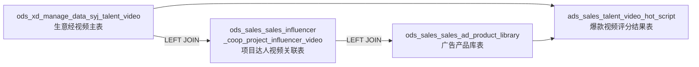
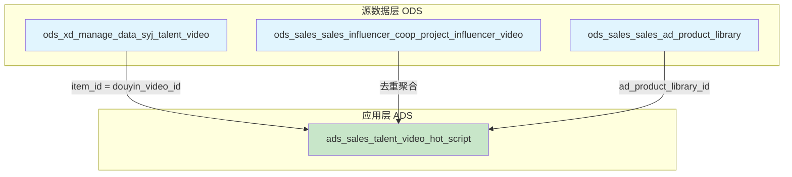

# 达人项目合作 ER 图（完整版）

> 根据实际业务 SQL 梳理的表关系
> 包含：达人合作 + 爆款视频评分脚本

---

## 一、所有表清单

| # | 表名（全称） | 别名 | 说明 |
|---|-------------|------|------|
| 1 | sales_influencer_coop_project | cp | 项目表 |
| 2 | sales_influencer_coop_project_influencer | cpi | 项目-达人关联表 |
| 3 | sales_influencer_coop_project_influencer_video | cpiv | 达人视频表 |
| 4 | sales_influencer | si | 达人表 |
| 5 | data_syj_talent_video | stv | 生意经视频信息表（旧） |
| 6 | **ods_xd_manage_data_syj_talent_video** | **t1** | **生意经视频数据主表（新）** |
| 7 | **ods_sales_sales_influencer_coop_project_influencer_video** | **t2** | **项目-达人-视频关联中间表** |
| 8 | **ods_sales_sales_ad_product_library** | **t3** | **广告产品库表** |
| 9 | **ads_sales_talent_video_hot_script** | **目标表** | **爆款视频热度评分结果表** |

---

## 二、ER 图

```mermaid
erDiagram
    sales_influencer_coop_project ||--o{ sales_influencer_coop_project_influencer : has
    sales_influencer_coop_project_influencer ||--o{ sales_influencer_coop_project_influencer_video : has
    sales_influencer_coop_project_influencer }o--|| sales_influencer : belongs_to
    sales_influencer_coop_project_influencer_video ||--o{ data_syj_talent_video : maps_to
    ods_xd_manage_data_syj_talent_video ||--o{ ods_sales_sales_influencer_coop_project_influencer_video : maps_to
    ods_sales_sales_influencer_coop_project_influencer_video }o--|| ods_sales_sales_ad_product_library : contains
    ads_sales_talent_video_hot_script }o--|| ods_xd_manage_data_syj_talent_video : source_from
    ads_sales_talent_video_hot_script }o--|| ods_sales_sales_ad_product_library : source_from

    sales_influencer_coop_project {
        int id PK
        varchar project_name
        datetime create_time
        datetime update_time
        int del_flag
    }
    sales_influencer_coop_project_influencer {
        int id PK
        int project_id FK
        int influencer_id FK
        datetime create_time
        datetime update_time
        int del_flag
    }
    sales_influencer_coop_project_influencer_video {
        int id PK
        int project_influencer_relation_id FK
        varchar douyin_video_id
        datetime create_time
        datetime update_time
        int del_flag
    }
    sales_influencer {
        int id PK
        varchar nickname
        varchar account
        varchar personal_page_url
        varchar uid
        datetime create_time
        datetime update_time
        int del_flag
    }
    data_syj_talent_video {
        int id PK
        varchar item_id
        int time_type
        varchar video_info
        datetime create_time
    }
    ods_xd_manage_data_syj_talent_video {
        int id PK
        varchar item_id
        varchar douyin_url
        varchar douyin_id
        varchar author_uid
        varchar nickname
        bigint fans_num_all
        varchar item_title
        bigint item_play_cnt
        bigint item_like_cnt
        bigint item_comment_cnt
        bigint item_pay_gmv
        varchar item_finish_play_ratio
        varchar play_5s_rate
        int item_sec
        int time_type
        datetime start_time
        datetime end_time
        datetime update_time
        string ds 分区
    }
    ods_sales_sales_influencer_coop_project_influencer_video {
        varchar douyin_video_id PK
        int ad_product_library_id FK
        int project_id FK
        int del_flag
        string ds 分区
    }
    ods_sales_sales_ad_product_library {
        int id PK
        int script_case_id
        int influencer_id
        varchar ai_script_content
        varchar video_path
        varchar video_cover_path
        string ds 分区
    }
    ads_sales_talent_video_hot_script {
        int id PK
        varchar item_id
        int project_id
        int ad_product_library_id
        varchar is_hot_video
        varchar hot_level
        decimal hot_score
        bigint item_pay_gmv
        bigint item_play_cnt
        int tag_sell_appearance
        int tag_sell_space
        int tag_sell_ad
        int tag_sell_range
        int tag_sell_brand
        int tag_sell_other
        int tag_policy_loan
        int tag_policy_replace
        int tag_policy_car_discount
        int tag_policy_insurance
        int tag_policy_charging
        int tag_policy_other
        string ds 分区
    }
```

---

## 三、SQL 中的关联关系详解

### 3.1 核心数据流



### 3.2 第1层关联：视频主表 → 项目达人视频关联表（LEFT JOIN）
```sql
FROM taidou_local_life.ods_xd_manage_data_syj_talent_video t1
LEFT JOIN (
    SELECT
        douyin_video_id,
        max(ad_product_library_id) as ad_product_library_id,
        max(project_id) as project_id
    FROM taidou_local_life.ods_sales_sales_influencer_coop_project_influencer_video
    WHERE ds >= '20260609' AND del_flag = '0'
    GROUP BY douyin_video_id
) t2
ON t1.item_id = t2.douyin_video_id
```
> **关联键：** `t1.item_id = t2.douyin_video_id`
> - t1 是主表（生意经视频）
> - t2 是子查询，先按 douyin_video_id 去重，再关联
> - LEFT JOIN 表示视频可能没有对应的项目关联

### 3.3 第2层关联：项目达人视频 → 广告产品库（LEFT JOIN）
```sql
LEFT JOIN taidou_local_life.ods_sales_sales_ad_product_library t3
ON t2.ad_product_library_id = t3.id
AND t3.ai_script_content IS NOT NULL
AND Trim(t3.ai_script_content) <> ''
AND t3.ds >= '20260609'
```
> **关联键：** `t2.ad_product_library_id = t3.id`
> - 通过广告产品库ID获取AI脚本内容（用于打标签）
> - 过滤掉 ai_script_content 为空的数据

### 3.4 爆款判断逻辑
```sql
CASE
    WHEN t1.item_play_cnt > 1000
    AND 完播率 > 0.03
    AND 5秒播放率 > 0.03
    AND t1.item_sec > 5
    AND (点赞 > 10 OR 评论 > 10 OR 收藏 > 10 OR 分享 > 10)
    AND (GMV > 0)
    THEN '爆款'
    ELSE '非爆款'
END AS is_hot_video
```

### 3.5 爆款分层逻辑

| 等级 | 播放量 | 完播率 | 5秒播放率 | 互动数 | GMV |
|------|--------|--------|-----------|--------|-----|
| 🥇 标杆爆款 | > 10000 | > 8% | > 8% | > 50 | > 20 |
| 🥈 优质爆款 | > 5000 | > 5% | > 5% | > 30 | > 10 |
| 🥉 普通爆款 | > 1000 | > 3% | > 3% | > 10 | > 0 |

### 3.6 标签体系

| 类别 | 标签 | 字段名 | 示例关键词 |
|------|------|--------|-----------|
| **核心卖点** | 外观 | tag_sell_appearance | 外观、颜值、造型、内饰好看 |
| | 空间 | tag_sell_space | 空间、二排、小桌板、后备箱 |
| | 智能驾驶 | tag_sell_ad | 智能驾驶、智驾、辅助驾驶 |
| | 续航 | tag_sell_range | 续航、插混、市区用电、长途用油 |
| | 品牌 | tag_sell_brand | 别克品牌、品牌故事 |
| | 其他 | tag_sell_other | 以上均未命中 |
| **政策权益** | 贷款 | tag_policy_loan | 免息、贷款、分期 |
| | 置换 | tag_policy_replace | 置换、旧车置换 |
| | 优惠 | tag_policy_car_discount | 1000抵、现金优惠 |
| | 保险 | tag_policy_insurance | 保险、车险 |
| | 充电 | tag_policy_charging | 充电桩、充电枪 |
| | 其他 | tag_policy_other | 以上均未命中 |

---

## 四、数据血缘（上下游依赖）



---

> 最后更新: 2026-07-02
