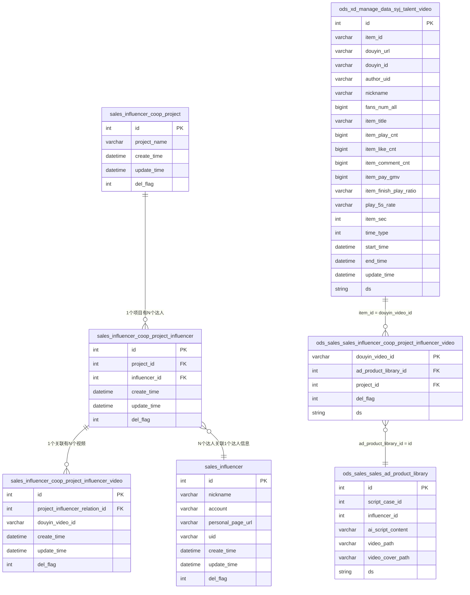
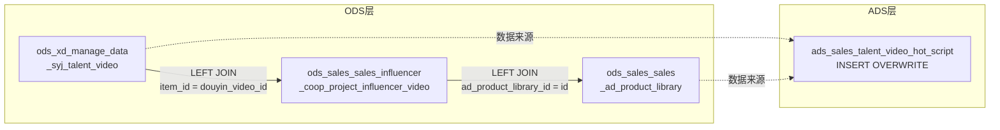
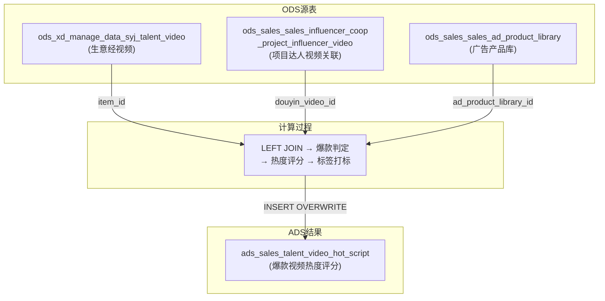

# 达人项目合作 ER 图（完整版）

> 根据实际业务 SQL 梳理的表关系
> 包含：达人合作 + 爆款视频评分脚本

---

## 一、所有表清单

| # | 层级 | 表名（全称） | 别名 | 说明 |
|---|------|-------------|------|------|
| 1 | 业务层 | sales_influencer_coop_project | cp | 项目表 |
| 2 | 业务层 | sales_influencer_coop_project_influencer | cpi | 项目-达人关联表 |
| 3 | 业务层 | sales_influencer_coop_project_influencer_video | cpiv | 达人视频表 |
| 4 | 业务层 | sales_influencer | si | 达人表 |
| 5 | ODS | **ods_xd_manage_data_syj_talent_video** | **t1** | **生意经视频数据主表** |
| 6 | ODS | **ods_sales_sales_influencer_coop_project_influencer_video** | **t2** | **项目-达人-视频关联表（ODS层）** |
| 7 | ODS | **ods_sales_sales_ad_product_library** | **t3** | **广告产品库表** |
| 8 | ADS | **ads_sales_talent_video_hot_script** | **目标表** | **爆款视频热度评分结果表** |

> 注：业务层 `sales_influencer_coop_project_influencer_video` 与 ODS 层 `ods_sales_sales_influencer_coop_project_influencer_video` 是同一业务的不同分层

---

## 二、表间关系



---

## 三、SQL 关联详解

### 3.1 核心数据流



### 3.2 第1层关联
```sql
FROM taidou_local_life.ods_xd_manage_data_syj_talent_video t1
LEFT JOIN (
    SELECT douyin_video_id,
           max(ad_product_library_id) as ad_product_library_id,
           max(project_id) as project_id
    FROM taidou_local_life.ods_sales_sales_influencer_coop_project_influencer_video
    WHERE ds >= '20260609' AND del_flag = '0'
    GROUP BY douyin_video_id
) t2 ON t1.item_id = t2.douyin_video_id
```
> **t1.item_id = t2.douyin_video_id** — 生意经视频通过 item_id 关联到项目达人视频

### 3.3 第2层关联
```sql
LEFT JOIN taidou_local_life.ods_sales_sales_ad_product_library t3
ON t2.ad_product_library_id = t3.id
AND t3.ai_script_content IS NOT NULL
AND Trim(t3.ai_script_content) <> ''
AND t3.ds >= '20260609'
```
> **t2.ad_product_library_id = t3.id** — 项目达人视频通过广告产品库ID关联广告产品信息

### 3.4 最终写入
```sql
INSERT OVERWRITE TABLE ads_sales_talent_video_hot_script PARTITION (ds='20260624')
SELECT ... FROM (...) t WHERE t.is_hot_video = '爆款'
```
> 结果写入 ADS 层，只保留爆款视频

---

## 四、爆款分层与评分

| 等级 | 播放量 | 完播率 | 5秒播放率 | 互动数 | GMV | 评分公式 |
|------|--------|--------|-----------|--------|-----|---------|
| 标杆爆款 | > 10000 | > 8% | > 8% | > 50 | > 20 | 7 + (得分/100) * 3 |
| 优质爆款 | > 5000 | > 5% | > 5% | > 30 | > 10 | 4 + (得分/100) * 2 |
| 普通爆款 | > 1000 | > 3% | > 3% | > 10 | > 0 | 1 + (得分/100) * 3 |
| 非爆款 | 不满足 | - | - | - | - | 0 |

---

## 五、标签体系

| 类别 | 标签 | 字段 | 关键词 |
|------|------|------|--------|
| 核心卖点 | 外观 | tag_sell_appearance | 外观、颜值、造型、内饰好看 |
| | 空间 | tag_sell_space | 空间、二排、小桌板、后备箱、座舱空间 |
| | 智能驾驶 | tag_sell_ad | 智能驾驶、智驾、辅助驾驶、自驾系统、逍遥智行 |
| | 续航 | tag_sell_range | 续航、插混、市区用电、长途用油、续航焦虑、三电 |
| | 品牌 | tag_sell_brand | 别克品牌、品牌故事、品牌口碑 |
| | 其他卖点 | tag_sell_other | 以上均未命中 |
| 政策权益 | 贷款 | tag_policy_loan | 免息、贷款、分期、金融礼 |
| | 置换 | tag_policy_replace | 置换、旧车置换、置换补贴 |
| | 优惠 | tag_policy_car_discount | 1000抵、下订抵扣、购车款抵扣、现金优惠 |
| | 保险 | tag_policy_insurance | 保险、车险、保险礼包 |
| | 充电 | tag_policy_charging | 充电桩、充电枪 |
| | 其他权益 | tag_policy_other | 以上均未命中 |

---

## 六、数据血缘



---

> 最后更新: 2026-07-02
