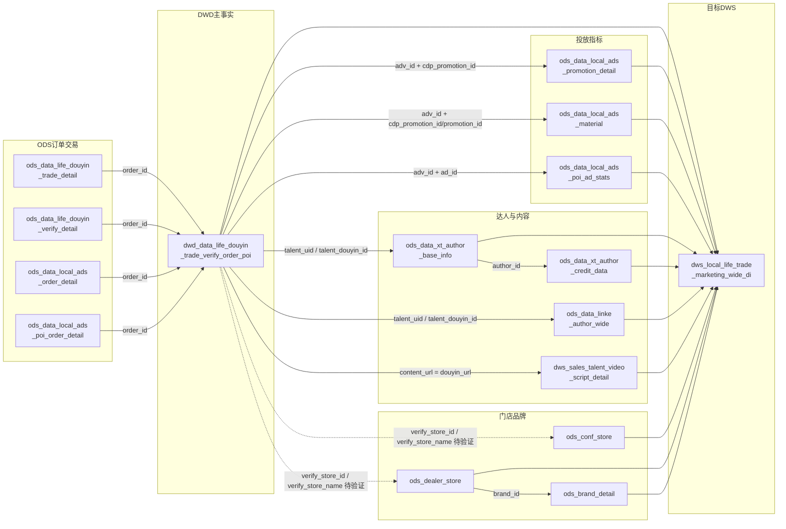

# 本地生活交易营销宽表 ER 图（元数据推断版）

> 根据已读取的 MaxCompute 元数据、已知 DWD 生成 DML、以及 `dws_local_life_trade_marketing_wide_di` 设计草案梳理。
> 连线标注格式：`左表.字段 = 右表.字段`。
> 注意：**元数据只能告诉我们字段名、类型、注释和分区，不能百分百证明业务主外键关系**。本文将关系分为：
>
> - **已知 DML 确认**：已有 SQL 明确使用该 Join。
> - **字段同名/业务强相关**：字段名和业务含义高度一致，但仍建议抽样验证。
> - **候选待验证**：仅从字段名、注释、设计目标推断，必须抽样验证匹配率。

---

## 一、所有表清单

| # | 层级 | 表名（全称） | 别名 | 说明 | 关联可信度 |
|---|---|---|---|---|---|
| 1 | DWD | `dwd_data_life_douyin_trade_verify_order_poi` | `dwd` | 订单、核销、标准投放、门店全域一体化主事实宽表 | 主表 |
| 2 | ODS | `ods_data_life_douyin_trade_detail` | `trade` | 抖音来客成交订单明细 | 已知 DML 确认 |
| 3 | ODS | `ods_data_life_douyin_verify_detail` | `verify` | 抖音来客核销明细 | 已知 DML 确认 |
| 4 | ODS | `ods_data_local_ads_order_detail` | `std_order` | 本地推标准投放成单明细 | 已知 DML 确认 |
| 5 | ODS | `ods_data_local_ads_poi_order_detail` | `poi_order` | 本地推门店全域成单明细 | 已知 DML 确认 |
| 6 | DWD | `dwd_union_ads_order_poi_order_detail` | `union_order` | 投放与门店全域成单订单集合，仅含 `order_id`、`ds` | 字段同名/业务强相关 |
| 7 | ODS | `ods_data_local_ads_promotion_detail` | `promotion` | 标准投放单元级日指标 | 字段同名/业务强相关 |
| 8 | ODS | `ods_data_local_ads_project_stats` | `project` | 标准投放项目级日指标 | 字段同名/业务强相关 |
| 9 | ODS | `ods_data_local_ads_material` | `material` | 标准投放素材级指标 | 字段同名/业务强相关 |
| 10 | ODS | `ods_data_local_ads_poi_ad_stats` | `poi_ad` | 门店全域单元级投放指标 | 字段同名/业务强相关 |
| 11 | ODS | `ods_data_xt_author_base_info` | `author` | 巨量星图达人基础信息 | 候选待验证 |
| 12 | ODS | `ods_data_xt_author_credit_data` | `credit` | 达人信用与履约能力 | 字段同名/业务强相关 |
| 13 | ODS | `ods_data_xt_author_video_metrics` | `author_metric` | 达人近 30/90 天传播能力指标 | 字段同名/业务强相关 |
| 14 | ODS | `ods_data_xt_author_latest_video` | `latest_video` | 达人最新视频 | 字段同名/业务强相关 |
| 15 | ODS | `ods_data_linke_author_wide` | `linke` | 抖音林客达人全维度宽表 | 候选待验证 |
| 16 | DWS | `dws_sales_talent_video_script_detail` | `script_video` | 单条视频指标与 AI 脚本明细 | 候选待验证 |
| 17 | ODS | `ods_xd_manage_data_local_ads_live_material_detail` | `live_mat` | 直播全域投放素材明细 | 候选待验证 |
| 18 | ODS | `ods_data_syj_live` | `syj_live` | 生意经直播间经营指标 | 候选待验证 |
| 19 | ODS | `ods_conf_store` | `store` | 内部门店配置 | 候选待验证 |
| 20 | ODS | `ods_conf_brand_store_address` | `brand_addr` | 品牌全国门店地址 | 候选待验证 |
| 21 | ODS | `ods_dealer_store` | `dealer_store` | 经销商门店维表 | 字段同名/业务强相关 |
| 22 | ODS | `ods_dealer_store_account` | `dealer_acct` | 经销商门店账户 | 字段同名/业务强相关 |
| 23 | ODS | `ods_brand_detail` | `brand` | 品牌维表 | 字段同名/业务强相关 |
| 24 | 目标 DWS | `dws_local_life_trade_marketing_wide_di` | `wide` | 本地生活交易营销宽表目标表 | 输出表 |

---

## 二、表间关系 ER 图

```mermaid
erDiagram
    %% ========== 主事实链路：已知 DML 确认 ==========
    ods_data_life_douyin_trade_detail ||--o{ ods_data_life_douyin_verify_detail : "trade.order_id = verify.order_id"
    ods_data_life_douyin_trade_detail ||--o{ ods_data_local_ads_order_detail : "trade.order_id = std_order.order_id"
    ods_data_life_douyin_trade_detail ||--o{ ods_data_local_ads_poi_order_detail : "trade.order_id = poi_order.order_id"
    ods_data_life_douyin_trade_detail ||--|| dwd_data_life_douyin_trade_verify_order_poi : "trade.order_id = dwd.order_id"
    ods_data_life_douyin_verify_detail }o--|| dwd_data_life_douyin_trade_verify_order_poi : "verify.order_id = dwd.order_id"
    ods_data_local_ads_order_detail }o--|| dwd_data_life_douyin_trade_verify_order_poi : "std_order.order_id = dwd.order_id"
    ods_data_local_ads_poi_order_detail }o--|| dwd_data_life_douyin_trade_verify_order_poi : "poi_order.order_id = dwd.order_id"

    %% ========== 订单集合校验 ==========
    dwd_data_life_douyin_trade_verify_order_poi ||--o| dwd_union_ads_order_poi_order_detail : "dwd.order_id = union_order.order_id"

    %% ========== 标准投放指标 ==========
    dwd_data_life_douyin_trade_verify_order_poi }o--o{ ods_data_local_ads_promotion_detail : "dwd.adv_id = promotion.adv_id; dwd.cdp_promotion_id = promotion.cdp_promotion_id"
    ods_data_local_ads_promotion_detail }o--o{ ods_data_local_ads_project_stats : "promotion.adv_id = project.adv_id; promotion.cdp_project_id = project.cdp_project_id"
    dwd_data_life_douyin_trade_verify_order_poi }o--o{ ods_data_local_ads_material : "dwd.adv_id = material.adv_id; dwd.cdp_promotion_id = material.promotion_id"
    ods_data_local_ads_material }o--o{ ods_data_local_ads_promotion_detail : "material.adv_id = promotion.adv_id; material.promotion_id = promotion.cdp_promotion_id"

    %% ========== 门店全域投放指标 ==========
    dwd_data_life_douyin_trade_verify_order_poi }o--o{ ods_data_local_ads_poi_ad_stats : "dwd.adv_id = poi_ad.adv_id; dwd.ad_id = poi_ad.ad_id"
    ods_data_local_ads_poi_order_detail }o--o{ ods_data_local_ads_poi_ad_stats : "poi_order.adv_id = poi_ad.adv_id; poi_order.ad_id = poi_ad.ad_id"

    %% ========== 达人链路 ==========
    dwd_data_life_douyin_trade_verify_order_poi }o--o| ods_data_xt_author_base_info : "dwd.talent_uid = author.author_id OR dwd.talent_douyin_id = author.unique_id"
    ods_data_xt_author_base_info ||--o| ods_data_xt_author_credit_data : "author.author_id = credit.author_id"
    ods_data_xt_author_base_info ||--o{ ods_data_xt_author_video_metrics : "author.author_id = author_metric.author_id"
    ods_data_xt_author_base_info ||--o{ ods_data_xt_author_latest_video : "author.author_id = latest_video.author_id"
    dwd_data_life_douyin_trade_verify_order_poi }o--o| ods_data_linke_author_wide : "dwd.talent_uid = linke.uid OR dwd.talent_douyin_id = linke.douyin_id/unique_id"

    %% ========== 视频/脚本链路 ==========
    dwd_data_life_douyin_trade_verify_order_poi }o--o| dws_sales_talent_video_script_detail : "dwd.content_url = script_video.douyin_url"
    ods_data_xt_author_base_info ||--o{ dws_sales_talent_video_script_detail : "author.author_id = script_video.author_uid"

    %% ========== 直播链路 ==========
    dwd_data_life_douyin_trade_verify_order_poi }o--o{ ods_xd_manage_data_local_ads_live_material_detail : "dwd.adv_id = live_mat.adv_id"
    ods_xd_manage_data_local_ads_live_material_detail }o--o| ods_data_syj_live : "live_mat.room_id = syj_live.room_id"
    ods_conf_store }o--o| ods_data_syj_live : "store.room_id = syj_live.room_id"

    %% ========== 门店/经销商/品牌维表 ==========
    ods_dealer_store ||--o{ ods_dealer_store_account : "dealer_store.id = dealer_acct.store_id"
    ods_dealer_store }o--|| ods_brand_detail : "dealer_store.brand_id = brand.brand_id"
    dwd_data_life_douyin_trade_verify_order_poi }o--o| ods_conf_store : "dwd.verify_store_id = store.id OR dwd.verify_store_name = store.name/nickname"
    dwd_data_life_douyin_trade_verify_order_poi }o--o| ods_dealer_store : "dwd.verify_store_id = dealer_store.id OR dwd.verify_store_name = dealer_store.store_name"
    ods_conf_store }o--o| ods_conf_brand_store_address : "store.org_id = brand_addr.org_id"

    %% ========== 目标宽表 ==========
    dwd_data_life_douyin_trade_verify_order_poi ||--o{ dws_local_life_trade_marketing_wide_di : "dwd.order_id/verify_record_id/verify_store_id => wide"
    ods_data_local_ads_promotion_detail }o--o{ dws_local_life_trade_marketing_wide_di : "promotion metrics => wide"
    ods_data_local_ads_poi_ad_stats }o--o{ dws_local_life_trade_marketing_wide_di : "poi ad metrics => wide"
    ods_data_xt_author_base_info }o--o{ dws_local_life_trade_marketing_wide_di : "author attrs => wide"
    dws_sales_talent_video_script_detail }o--o{ dws_local_life_trade_marketing_wide_di : "video/script attrs => wide"
```



---

## 三、关联关系速查表

| # | 左表 | 关联键 | 右表 | JOIN 类型 | 可信度 | 说明 |
|---|---|---|---|---|---|---|
| 1 | `trade` 订单明细 | **`trade.order_id = verify.order_id`** | `verify` 核销明细 | LEFT JOIN / 1:N | 已知 DML 确认 | 一单可能多券、多核销记录 |
| 2 | `trade` 订单明细 | **`trade.order_id = std_order.order_id`** | `std_order` 标准投放成单 | LEFT JOIN | 已知 DML 确认 | DWD 已按该关系接入 |
| 3 | `trade` 订单明细 | **`trade.order_id = poi_order.order_id`** | `poi_order` 门店全域成单 | LEFT JOIN | 已知 DML 确认 | DWD 已按该关系接入 |
| 4 | `dwd` 主事实 | **`dwd.order_id = union_order.order_id`** | `union_order` 成单订单集合 | LEFT SEMI / 校验 | 字段同名/业务强相关 | 用于圈选或校验投放成单，不补字段 |
| 5 | `dwd` 主事实 | **`dwd.adv_id = promotion.adv_id`** 且 **`dwd.cdp_promotion_id = promotion.cdp_promotion_id`** | `promotion` 标准投放单元指标 | LEFT JOIN | 字段同名/业务强相关 | 还需加 `promotion.stat_time_day = ds` |
| 6 | `promotion` 单元指标 | **`promotion.adv_id = project.adv_id`** 且 **`promotion.cdp_project_id = project.cdp_project_id`** | `project` 项目指标 | LEFT JOIN | 字段同名/业务强相关 | 用于项目级属性/指标补充 |
| 7 | `dwd` 主事实 | **`dwd.adv_id = material.adv_id`** 且 **`dwd.cdp_promotion_id = material.promotion_id`** | `material` 素材指标 | LEFT JOIN | 字段同名/业务强相关 | 素材侧需先聚合到单元日，避免放大订单金额 |
| 8 | `material` 素材指标 | **`material.adv_id = promotion.adv_id`** 且 **`material.promotion_id = promotion.cdp_promotion_id`** | `promotion` 单元指标 | LEFT JOIN | 字段同名/业务强相关 | `promotion_id` 与 `cdp_promotion_id` 命名不同但业务含义接近 |
| 9 | `dwd` 主事实 | **`dwd.adv_id = poi_ad.adv_id`** 且 **`dwd.ad_id = poi_ad.ad_id`** | `poi_ad` 门店全域指标 | LEFT JOIN | 字段同名/业务强相关 | 还需加 `poi_ad.stat_time_day = ds` |
| 10 | `poi_order` 门店全域成单 | **`poi_order.adv_id = poi_ad.adv_id`** 且 **`poi_order.ad_id = poi_ad.ad_id`** | `poi_ad` 门店全域指标 | LEFT JOIN | 字段同名/业务强相关 | 可用于从成单侧到指标侧对账 |
| 11 | `dwd` 主事实 | **`dwd.talent_uid = author.author_id`** 或 **`dwd.talent_douyin_id = author.unique_id`** | `author` 星图达人基础 | LEFT JOIN | 候选待验证 | ID 体系可能不同，必须抽样验证 |
| 12 | `author` 星图达人基础 | **`author.author_id = credit.author_id`** | `credit` 达人信用 | LEFT JOIN | 字段同名/业务强相关 | 同为 `author_id`，可信度较高 |
| 13 | `author` 星图达人基础 | **`author.author_id = author_metric.author_id`** | `author_metric` 达人传播指标 | LEFT JOIN | 字段同名/业务强相关 | 指标表是达人级，不是视频级 |
| 14 | `author` 星图达人基础 | **`author.author_id = latest_video.author_id`** | `latest_video` 最新视频 | LEFT JOIN / 1:N | 字段同名/业务强相关 | 最新视频多条，需取最新或聚合 |
| 15 | `dwd` 主事实 | **`dwd.talent_uid = linke.uid`** 或 **`dwd.talent_douyin_id = linke.douyin_id/unique_id`** | `linke` 林客达人宽表 | LEFT JOIN | 候选待验证 | 林客 UID、抖音号、星图 ID 可能不是同一体系 |
| 16 | `dwd` 主事实 | **`dwd.content_url = script_video.douyin_url`** | `script_video` 视频脚本明细 | LEFT JOIN | 候选待验证 | URL 格式可能不一致，建议先标准化 URL |
| 17 | `author` 星图达人基础 | **`author.author_id = script_video.author_uid`** | `script_video` 视频脚本明细 | LEFT JOIN / 1:N | 候选待验证 | `author_uid` 可能是抖音 UID，不一定等于星图 `author_id` |
| 18 | `dwd` 主事实 | **`dwd.adv_id = live_mat.adv_id`** | `live_mat` 直播投放素材 | LEFT JOIN | 候选待验证 | 缺少 `room_id` 时归因较弱 |
| 19 | `live_mat` 直播投放素材 | **`live_mat.room_id = syj_live.room_id`** | `syj_live` 生意经直播 | LEFT JOIN | 字段同名/业务强相关 | 需加日期条件或直播时间窗口 |
| 20 | `store` 内部门店 | **`store.room_id = syj_live.room_id`** | `syj_live` 生意经直播 | LEFT JOIN | 字段同名/业务强相关 | 仅适用于维护了 `room_id` 的门店 |
| 21 | `dealer_store` 经销商门店 | **`dealer_store.id = dealer_acct.store_id`** | `dealer_acct` 门店账户 | LEFT JOIN / 1:N | 字段同名/业务强相关 | 账户可多条 |
| 22 | `dealer_store` 经销商门店 | **`dealer_store.brand_id = brand.brand_id`** | `brand` 品牌维表 | LEFT JOIN / N:1 | 字段同名/业务强相关 | 品牌内部链路稳定 |
| 23 | `dwd` 主事实 | **`dwd.verify_store_id = store.id`** 或 **`dwd.verify_store_name = store.name/nickname`** | `store` 内部门店 | LEFT JOIN | 候选待验证 | 当前未看到稳定抖音 POI ID 字段 |
| 24 | `dwd` 主事实 | **`dwd.verify_store_id = dealer_store.id`** 或 **`dwd.verify_store_name = dealer_store.store_name`** | `dealer_store` 经销商门店 | LEFT JOIN | 候选待验证 | 名称 Join 不稳定，仅可作为兜底探索 |
| 25 | `store` 内部门店 | **`store.org_id = brand_addr.org_id`** | `brand_addr` 品牌门店地址 | LEFT JOIN | 字段同名/业务强相关 | 可补充品牌门店地址，但门店粒度需验证 |

---

## 四、SQL 关联详解

### 4.1 主事实 DWD 生成链路（已知 DML 确认）

```sql
FROM ods_data_life_douyin_trade_detail trade
LEFT JOIN ods_data_life_douyin_verify_detail verify
  ON trade.order_id = verify.order_id
 AND verify.ds >= '20260501'
LEFT JOIN ods_data_local_ads_order_detail std_order
  ON trade.order_id = std_order.order_id
 AND std_order.ds >= '20260501'
LEFT JOIN ods_data_local_ads_poi_order_detail poi_order
  ON trade.order_id = poi_order.order_id
 AND poi_order.ds >= '20260501'
WHERE trade.ds >= '20260501'
```

> **核心键：`order_id`**。
> 这是目前最确定的事实链路：订单明细通过 `order_id` 接核销、标准投放成单、门店全域成单。

### 4.2 标准投放单元指标关联

```sql
LEFT JOIN ods_data_local_ads_promotion_detail promotion
  ON dwd.adv_id = promotion.adv_id
 AND dwd.cdp_promotion_id = promotion.cdp_promotion_id
 AND promotion.stat_time_day = '${bizdate}'
 AND promotion.ds >= '20260501'
```

> **核心键：`adv_id + cdp_promotion_id + stat_time_day/ds`**。
> 该关系从字段名和业务含义看较强，但因为指标表是“单元日粒度”，订单明细接入时不会改变订单行数，指标金额则是日汇总指标，不能直接与订单金额相加对账。

### 4.3 标准投放素材指标关联

```sql
WITH material_metric AS (
  SELECT
      adv_id,
      promotion_id,
      stat_time_day,
      SUM(stat_cost) AS ad_cost,
      COUNT(DISTINCT material_id) AS material_cnt
  FROM ods_data_local_ads_material
  WHERE ds >= '20260501'
  GROUP BY adv_id, promotion_id, stat_time_day
)
SELECT ...
FROM dwd_data_life_douyin_trade_verify_order_poi dwd
LEFT JOIN material_metric material
  ON dwd.adv_id = material.adv_id
 AND dwd.cdp_promotion_id = material.promotion_id
 AND material.stat_time_day = '${bizdate}'
```

> **核心键：`adv_id + cdp_promotion_id/promotion_id + stat_time_day`**。
> 素材表通常一个投放单元下有多素材，必须先聚合到单元日，否则会放大订单行数和金额。

### 4.4 门店全域投放指标关联

```sql
LEFT JOIN ods_data_local_ads_poi_ad_stats poi_ad
  ON dwd.adv_id = poi_ad.adv_id
 AND dwd.ad_id = poi_ad.ad_id
 AND poi_ad.stat_time_day = '${bizdate}'
 AND poi_ad.ds >= '20260501'
```

> **核心键：`adv_id + ad_id + stat_time_day/ds`**。
> `ad_id` 在门店全域成单明细和门店全域投放指标表中均存在，是门店全域链路里最重要的计划/单元键。

### 4.5 达人基础、信用、传播指标关联

```sql
LEFT JOIN ods_data_xt_author_base_info author
  ON dwd.talent_uid = author.author_id
  OR dwd.talent_douyin_id = author.unique_id

LEFT JOIN ods_data_xt_author_credit_data credit
  ON author.author_id = credit.author_id

LEFT JOIN ods_data_xt_author_video_metrics author_metric
  ON author.author_id = author_metric.author_id

LEFT JOIN ods_data_xt_author_latest_video latest_video
  ON author.author_id = latest_video.author_id
```

> **核心候选键：`author_id`、`unique_id`、`talent_uid`、`talent_douyin_id`**。
> 星图表内部通过 `author_id` 关联可信度较高；但 DWD 主表中的 `talent_uid`、`talent_douyin_id` 是否等于星图 `author_id`/`unique_id` 必须抽样验证。

### 4.6 林客达人宽表关联

```sql
LEFT JOIN ods_data_linke_author_wide linke
  ON dwd.talent_uid = linke.uid
  OR dwd.talent_douyin_id = linke.douyin_id
  OR dwd.talent_douyin_id = linke.unique_id
```

> **核心候选键：`uid`、`douyin_id`、`unique_id`**。
> 林客达人宽表与星图达人表 ID 体系可能不同，建议优先验证 `talent_douyin_id = linke.douyin_id/unique_id` 的匹配率。

### 4.7 视频脚本明细关联

```sql
LEFT JOIN dws_sales_talent_video_script_detail script_video
  ON dwd.content_url = script_video.douyin_url
```

> **核心候选键：`content_url = douyin_url`**。
> 如果 URL 带参数、短链、协议差异，需要先标准化后再关联。备选关联是 `talent_uid = author_uid`，但这会把达人下多条视频关联到同一订单，风险更高。

### 4.8 门店、经销商、品牌维表关联

```sql
LEFT JOIN ods_dealer_store_account dealer_acct
  ON dealer_store.id = dealer_acct.store_id

LEFT JOIN ods_brand_detail brand
  ON dealer_store.brand_id = brand.brand_id

LEFT JOIN ods_conf_brand_store_address brand_addr
  ON store.org_id = brand_addr.org_id
```

> **内部维表键：`store_id`、`brand_id`、`org_id`**。
> 经销商门店、账户、品牌之间的字段关系较清晰；但它们与 DWD 的 `verify_store_id/verify_store_name` 是否同体系尚不确定。

---

## 五、数据血缘



---

## 六、关联键可信度分层

### 6.1 可以直接优先使用的关联键

| 关联键 | 适用表 | 原因 |
|---|---|---|
| `order_id` | 订单、核销、标准投放成单、门店全域成单、DWD 主事实 | 已知 DML 明确使用 |
| `adv_id + cdp_promotion_id + stat_time_day` | DWD 主事实、标准投放单元指标 | 字段同名/业务含义强相关 |
| `adv_id + promotion_id + stat_time_day` | DWD 主事实、素材指标 | `promotion_id` 对应 DWD 的 `cdp_promotion_id`，需统一命名 |
| `adv_id + ad_id + stat_time_day` | DWD 主事实、门店全域指标 | 门店全域链路核心键 |
| `author_id` | 星图达人基础、达人信用、达人传播指标、最新视频 | 星图表内部统一字段 |
| `brand_id` | 经销商门店、品牌维表 | 维表内部稳定字段 |
| `store_id` | 经销商门店、门店账户 | 维表内部稳定字段 |

### 6.2 必须抽样验证后才能上线的关联键

| 候选关联键 | 风险 |
|---|---|
| `dwd.talent_uid = author.author_id` | 星图 `author_id` 可能不是抖音 UID |
| `dwd.talent_douyin_id = author.unique_id` | 抖音号、unique_id、达人主页 ID 可能格式不同 |
| `dwd.talent_uid = linke.uid` | 林客 UID 与 DWD UID 体系可能不同 |
| `dwd.talent_douyin_id = linke.douyin_id/unique_id` | 需要验证是否包含抖音号、短 ID、展示号等不同形态 |
| `dwd.content_url = script_video.douyin_url` | URL 可能存在短链、参数、协议、尾斜杠差异 |
| `dwd.verify_store_id = store.id/dealer_store.id` | 抖音核销门店 ID 未必等于内部门店 ID/经销商门店 ID |
| `dwd.verify_store_name = store.name/dealer_store.store_name` | 名称 Join 容易受简称、门店后缀、特殊符号影响 |
| `dwd.adv_id = live_mat.adv_id` | 只有广告主 ID 关联粒度过粗，缺少 `room_id` 或素材 ID 时归因弱 |

---

## 七、建议的 Join Key 抽样验证 SQL

### 7.1 验证达人 ID 匹配率

```sql
SELECT
    COUNT(*) AS dwd_row_cnt,
    SUM(CASE WHEN a.author_id IS NOT NULL THEN 1 ELSE 0 END) AS hit_author_by_uid_cnt,
    SUM(CASE WHEN a2.author_id IS NOT NULL THEN 1 ELSE 0 END) AS hit_author_by_unique_id_cnt,
    SUM(CASE WHEN l.uid IS NOT NULL THEN 1 ELSE 0 END) AS hit_linke_by_uid_cnt,
    SUM(CASE WHEN l2.uid IS NOT NULL THEN 1 ELSE 0 END) AS hit_linke_by_douyin_id_cnt
FROM dwd_data_life_douyin_trade_verify_order_poi d
LEFT JOIN ods_data_xt_author_base_info a
  ON d.talent_uid = a.author_id
 AND a.ds >= '20260501'
LEFT JOIN ods_data_xt_author_base_info a2
  ON d.talent_douyin_id = a2.unique_id
 AND a2.ds >= '20260501'
LEFT JOIN ods_data_linke_author_wide l
  ON d.talent_uid = l.uid
 AND l.ds >= '20260501'
LEFT JOIN ods_data_linke_author_wide l2
  ON d.talent_douyin_id = l2.douyin_id
 AND l2.ds >= '20260501'
WHERE d.ds >= '20260501';
```

### 7.2 验证视频 URL 匹配率

```sql
SELECT
    COUNT(*) AS dwd_row_cnt,
    SUM(CASE WHEN s.video_id IS NOT NULL THEN 1 ELSE 0 END) AS hit_script_video_cnt
FROM dwd_data_life_douyin_trade_verify_order_poi d
LEFT JOIN dws_sales_talent_video_script_detail s
  ON d.content_url = s.douyin_url
 AND s.ds >= '20260501'
WHERE d.ds >= '20260501'
  AND d.content_url IS NOT NULL
  AND d.content_url <> '';
```

### 7.3 验证门店 ID/名称匹配率

```sql
SELECT
    COUNT(*) AS dwd_row_cnt,
    SUM(CASE WHEN s.id IS NOT NULL THEN 1 ELSE 0 END) AS hit_conf_store_by_id_cnt,
    SUM(CASE WHEN ds.id IS NOT NULL THEN 1 ELSE 0 END) AS hit_dealer_store_by_id_cnt,
    SUM(CASE WHEN ds2.id IS NOT NULL THEN 1 ELSE 0 END) AS hit_dealer_store_by_name_cnt
FROM dwd_data_life_douyin_trade_verify_order_poi d
LEFT JOIN ods_conf_store s
  ON d.verify_store_id = CAST(s.id AS STRING)
 AND s.ds >= '20260501'
LEFT JOIN ods_dealer_store ds
  ON d.verify_store_id = CAST(ds.id AS STRING)
 AND ds.ds >= '20260501'
LEFT JOIN ods_dealer_store ds2
  ON d.verify_store_name = ds2.store_name
 AND ds2.ds >= '20260501'
WHERE d.ds >= '20260501';
```

### 7.4 验证投放指标接入是否放大订单行数

```sql
WITH base AS (
    SELECT order_id, verify_record_id, verify_store_id, adv_id, cdp_promotion_id, ad_id
    FROM dwd_data_life_douyin_trade_verify_order_poi
    WHERE ds >= '20260501'
),
joined AS (
    SELECT
        b.order_id,
        b.verify_record_id,
        b.verify_store_id
    FROM base b
    LEFT JOIN ods_data_local_ads_promotion_detail p
      ON b.adv_id = p.adv_id
     AND b.cdp_promotion_id = p.cdp_promotion_id
     AND p.stat_time_day = '${bizdate}'
     AND p.ds >= '20260501'
    LEFT JOIN ods_data_local_ads_poi_ad_stats pa
      ON b.adv_id = pa.adv_id
     AND b.ad_id = pa.ad_id
     AND pa.stat_time_day = '${bizdate}'
     AND pa.ds >= '20260501'
)
SELECT
    COUNT(*) AS joined_row_cnt,
    COUNT(DISTINCT CONCAT(order_id, '_', COALESCE(verify_record_id, ''), '_', COALESCE(verify_store_id, ''))) AS joined_key_cnt
FROM joined;
```

---

> 最后更新: 2026-07-08